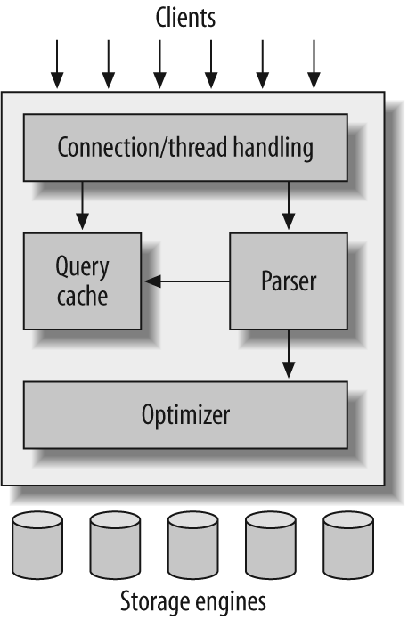

# Mysql

## Logical Architecture

The topmost layer contains the services that aren’t unique to MySQL. They’re services most network-based client/server tools or servers need: connection handling, authentication, security, and so forth.

The second layer includes the code for query parsing, analysis, optimization, caching, and all the built-in functions \(e.g., dates, times, math, and encryption\). Any functionality provided across storage engines lives at this level: stored procedures, triggers, and views, for example.

The third layer contains the storage engines. They are responsible for storing and retrieving all data stored “in” MySQL.The server communicates with them through the _storage engine API_. This interface hides differences between storage engines and makes them largely transparent at the query layer. The API contains a couple of dozen low-level functions that perform operations such as “begin a transaction” or “fetch the row that has this primary key.” The storage engines don’t parse SQL or communicate with each other; they simply respond to requests from the server.

