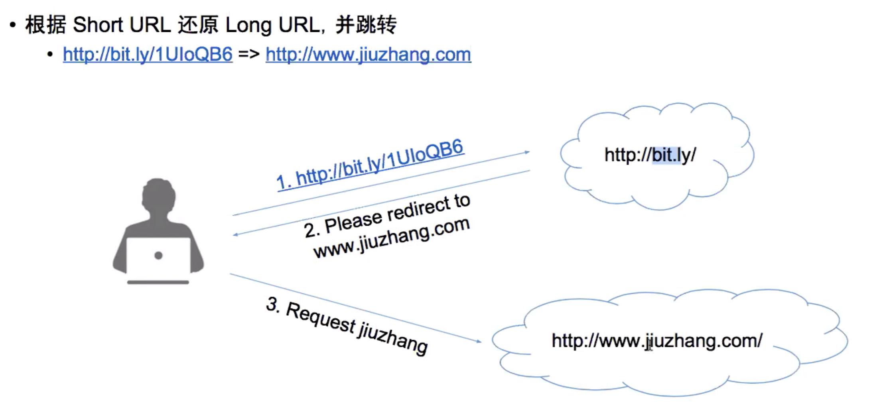
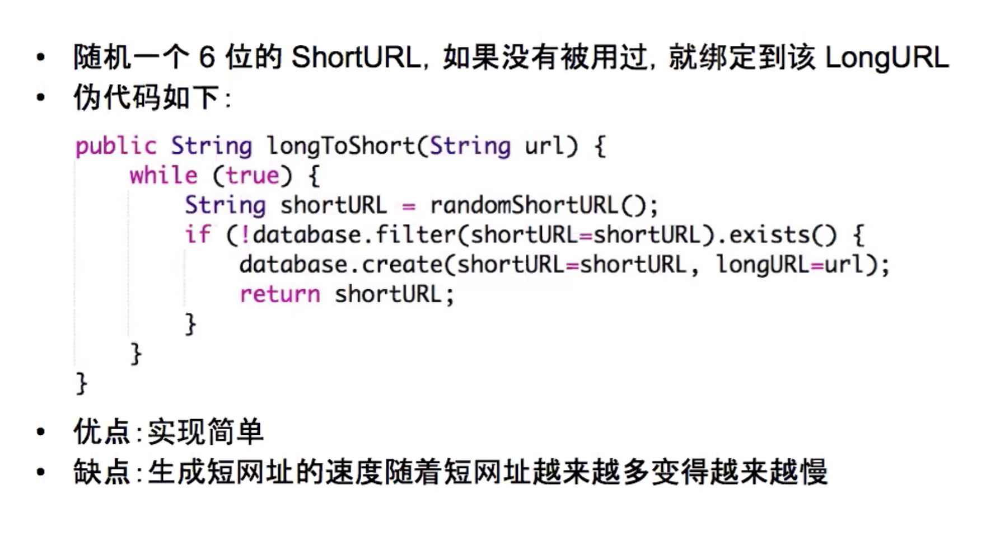
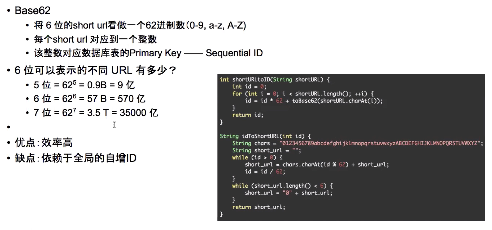
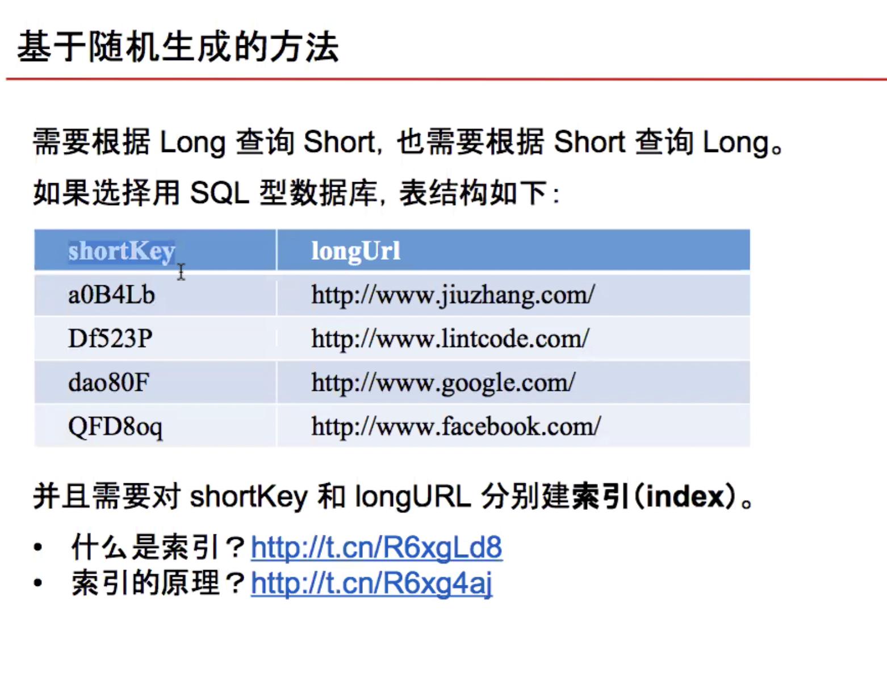
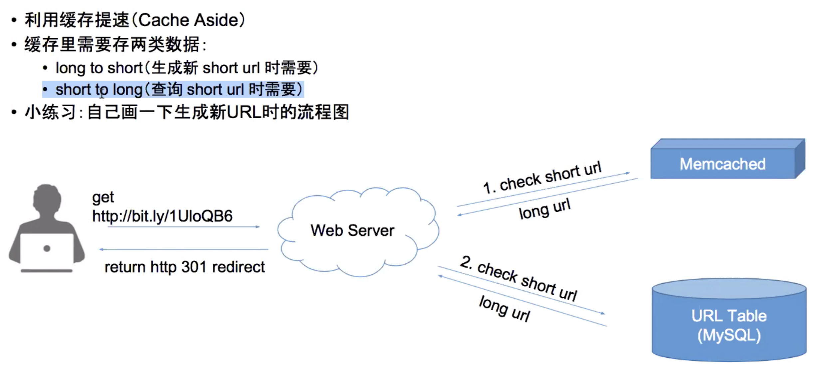
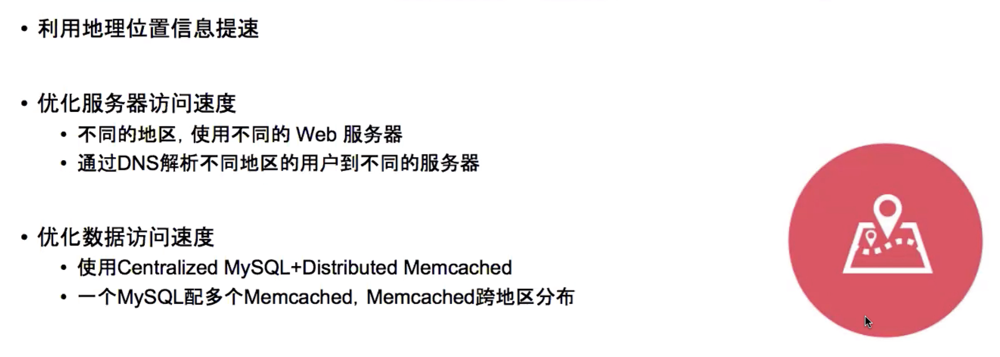
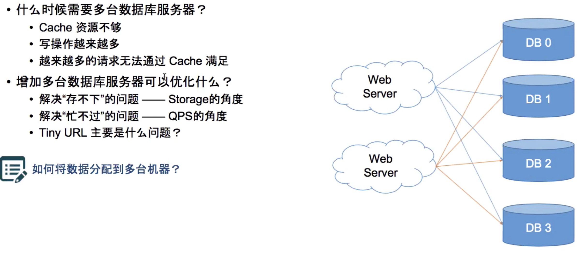
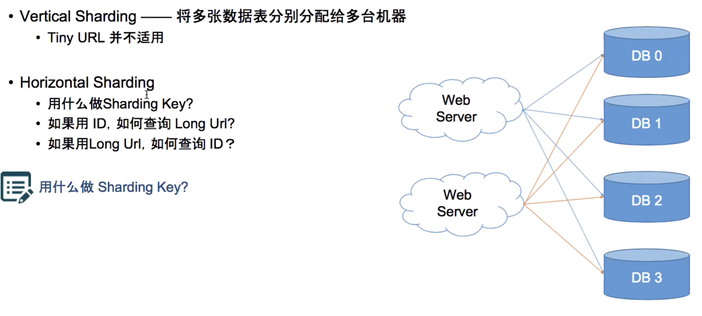

# Consistent Hashing & Design Tiny URL

## Single Point Failure

### Sharding -&gt; Partition

* Partition data into different parts based on certain rules, and saving those parts to different machines
* Even if one point gets down, it is not going to lead the entire system to be down
* Replica -&gt; Duplicate
  * Duplicate data into many copies \(usually three copies\)
  * Amortize read requests


SQL Databases do not have built-in sharding, NoSQL databases usually have built-in sharding.



Usually NoSQL database use key-value to query whereas SQL based database usually use relational, structural language to query.


#### Vertical Sharding

* One table for one database
* or partition a table based on each column into two or more tables
  * User table
    * email id, user id,  password rarely change -&gt; User table
    * avatar, status\_text often change -&gt; User profile
* Disadvantages
  * if the table is really big

#### Horizontal Sharding

* Simple idea is to use the id to mod number of machines
  * Problem
    * What if add new machines, then many data need to be moved
      * Slow, write
      * server gets heavy load
      * data inconsistency

## Consistent Hashing

For solving single point failure.

### Inconsistent hashing

* % n is the easiest way to do hashing
* but when n turns into n + 1, every key % n and key % \(n + 1\) gets different results
* therefore, this way is called inconsistent hashing
* the problem with this solution is that when adding a new server, many keys have been hashed to a different value, therefore it needs to move many data

### A simple consistent hasing

* use key to mod a very large number, like 360
* distribute 360 to n machines, each machine in charge of a certain interval
* a table stores information about how 360 is being distributed is stored in a web server
* when adding a new machine, insert randomly at a position in the table, take some throughputs from adjacent two servers
* if adding a machine like n from 2 - 3, only 1/3 of the data needs to be moved
* disadvantages:
  * data is distributed unevenly
  * data migration overloaded for old machines since new machine only is going to load data from those two machines


### Consistent Hashing

* Treat the entire interval as a ring
* There are  2\*\*64 - 1 points on this ring representing either a machine or a data
* Micro shards / virtual nodes
  * One physical machine maps to 1000 micro shards or virtual nodes
  * how
    * one idea is to use '.1', like 'memcache-01.1',  'memcache-01.2'...'memcache-01.1000'
* Every virtual node maps to a point on hash
* Every time a new machine is added, 1000 points on ring will be randomly put as virtual nodes
* When need to calculate which machine a key should be mapped to
  * get the hash value for this key --&gt; a value in 0 ~ 2\*\*64 - 1, which maps to a point on the ring
  * clockwise to find the first virtual node
  * the machine that this virtual node belongs to is the server that this key should maps to
* Data migration for adding a new machine
  * 1000 virtual nodes ask data from the first node it found clockwise on the ring
* Data structure used to achieve this
  * red-black tree
* The purpose for this algorithm is to make sure every physical machine can take part in sharing parts of its entire data to the new machine, therefore the burden on each machine while doing the data migration could be mitigated

## Backup vs Replica

### Backup

* Periodical, like data backup every night
* When data got lost, usually it can only be recovered to a certain point of time
* Backup is not used as online data service, it is not helping read access

### Replica

* real-time, when data is being write to the database, it will be copied and stored as many replicas
* When data got lost, the system can recover data from other replicas
* Replica is used as online data service, accepting read requests

### Master - Slave

* Write Ahead Log
  * Any operations on SQL database will recorded as log
    * for example, data A is changed from C to D at time B
  * Slave tells master that it is alive
  * Every time there's operation on master, it will ask slave to read log
  * It has delay when changes reflected on slave
* Mater is down
  * Promote one slave into a master, accepting read + write
  * May cause data lost and inconsistency
* Disadvantages
  * Write operations are not amortized
    * But can be resolved by sharding, multiple machines for write
  * There's delay between write operations reflected in slave
    * But when you want to get a number that is not necessary to be that accurate, like upvotes, you can read your data from slave

#### SQL vs NoSQL in Replica

SQL

* built-in replica mechanism is Mater / Slave
* manual replica mechanism is to store three copies on ring of consistent hashing

NoSQL

* built-in replica mechanism is to store copies on the ring of consistent hashing

Query Data

1. if the data requested do not need to be accurate, then it broadcasts the request to all nodes, and get the data from the server that responded quickest.
2. if the data requested needs to be accurate, then it broadcasts the request to all nodes, and wait for at least two nodes return data

## Tiny / Short URL

### Scenario



#### Things need to check

* Does long and short URLs have to be on a one to one relation
  * usually long -&gt; short can be one to many, but short -&gt; long has to be one to one
* Does it need to release that short URL if the URL has been used for a long time
  * better not

#### Requirements

* DAU
  * 100M
* Calculate QPS for generating one tiny URL
  * Imagine every user posts 0.1 post per day
  * Average Write QPS = 100M \* 0.1/86400 ~ 100
  * Peak Write QPS = 100 \* 3 = 300
* Calculate QPS for clicking the tiny URL
  * Every user clicks the tiny URL
  * Average read QPS = 100M \* 1 / 86400 ~ 1k
  * Peak read QPS = 3 \* 1k ~= 3k
* Calculate new tiny URL generated every day:
  * 100M \* 0.1 ~ 10M
  * Every URL consumes 100KB ~ total 1G \(maybe 50?\)
  * 1T disk can be used for 3 years
* 3k QPS
  * one ssd + mysql can handle

### Service

* One service
  * URLService.encode\(long\_url\)
  * URLService.decode\(short\_url\)
* Endpoint
  * GET /&lt;short\_url&gt;
    * return a http redirect response
  * POST /data/shorten
    * Data = {url: http://xxxx}
    * Return short url


301 Moved Permanently, the browser can cache the url

302 Moved Temporally, next time the request still has to go to the redirect server 


### Storage

* SQL or NoSQL
  * Support Transaction
    * No -&gt; NoSQL \(NoSQL does not support transaction\)
  * Support rich query?
    * No -&gt; NoSQL
  * Code complexity
    * Not complicated
  * QPS requirements -&gt; 3k, not too high, and can use Cache, write operation is also low. SQL
  * Scalability requirements -&gt; not too high
    * Engineer has to scale it by using sharding and replica for SQL DB
    * NoSQL has all handy feature for scaling
  * Needs Sequential ID -&gt; depends on your algorithm
    * SQL provides auto-incremented sequential ID
    * NoSQL id is not sequential
  * If writes heavy, then the bottleneck is going to be write lock \(for example on this auto-increment id\)
* How to transform a long URL to a short one
  * Hash \(naive\)
  * randomly generate a string and check if db has already had one



* Base62
  * 0-9, a-z, A-Z



```python
# generate short url randomly and db deduplication
func longToShort(long_url):
    while true:
        short_url = randomShortURL()
        if database.filter(short_url) is None:
            database.update(short_url, long_url)
            return short_url
```



### Scale

#### Speed up










How to choose sharding key largely depends on how you want to search in db.


