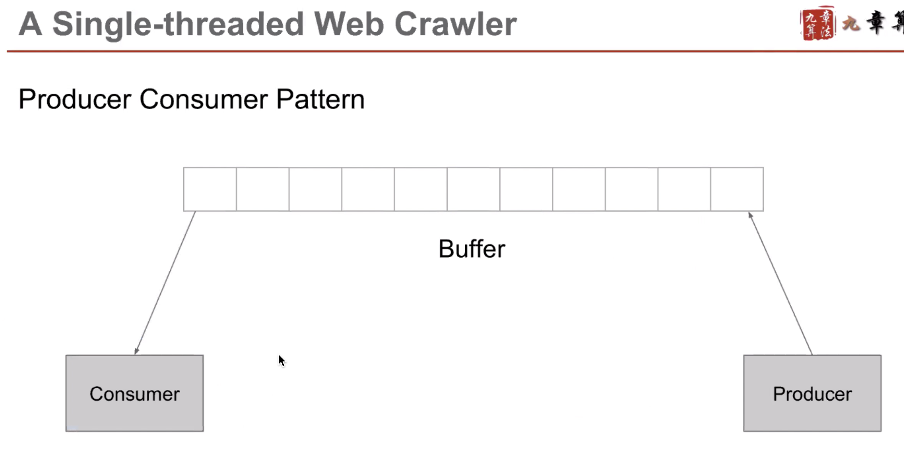
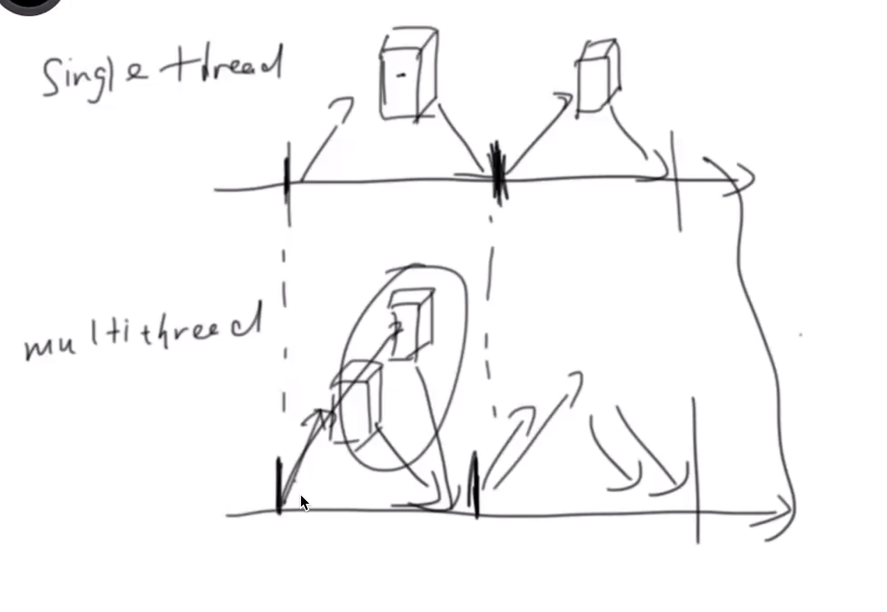
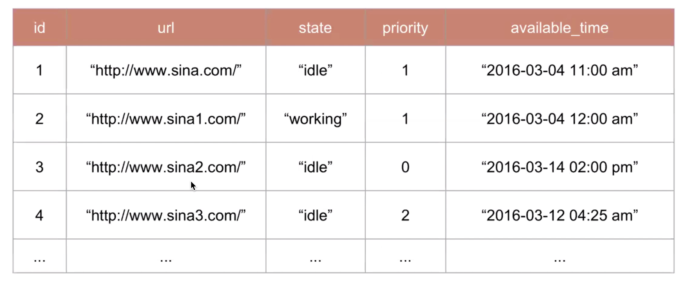
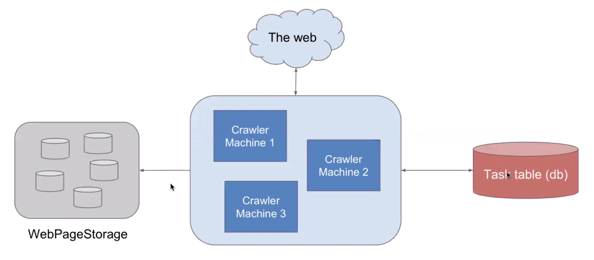

# Crawlers, Typehead

## Design a Web Crawler \(Google\)

Google uses web crawlers to implement its search engine. Since each site is possibly updating everyday, google crawls those sites not only one time, but many times periodically. Usually the purpose of web crawler is to fetch the content of web pages to process, extract and analyze

### Scenario

* How many pages
  * crawl **1.6m web pages per second** \(1,000,000,000,000 / 7 / 86400 \)
    * 1 trilion web pages
* How often \(crawling frequency\)
  * crawl all of them **every week**
* How large \(space\)
  * 10p \(petabyte\) web page storage \(Distributed System\)
    * average of a web page 10k

### A simplistic news crawler

* given the url of news list page
  * Send an http request to get the content of the news list page
    * use lib to get the content of the web page
  * Extract all the news titles from the news list page
    * use regular expression to match title content

### Crawling Algorithm

* DFS

### A Single-Threaded Web Crawler


To implement a producer and consumer pattern, you'll need to create two threads for each role \(consumers and producers\). Set the speed of each thread to process differently.


### A Multi-threaded Web Crawler

* multi-threaded model share the same crawling queue

### How different threads work together

* Three approaches
  * sleep
  * condition variable 
    * Try to lock and consume the resource once it's been released
  * semaphore \(信号量， 是一个整数\)
    * Allow multiple consumers to lock resource


However, more threads do not necessarily mean more performance

Why?

* Context switch cost \(Single core CPU\)
* Number of Thread \(port\) limitations
* Network bottleneck for single machine


### A distributed Web Crawler

#### Problem with Task Queue

* Queue is a data structure stored in memory but we may have tons of tasks
* Once the url has been pushed to queue, the order is fixed, but often the cases we crawl each url with different orders and frequency

#### Design task table

* Usually a task table contains tasks that each represents a url to crawl
  * each task may contain a url, state, priority and available time


The way to see if the content crawled from a url is different from last time it's crawled is to hash the web content to get a hash value, with the hash value we can compare it with last value


* Get 1000 tasks per request from task table
  * once a task is being processing by a crawler machine, it will be marked as working \(繁忙\) to represent current status, and will not be processed again by crawlers. Other tasks with status 'idle' can be distributed by task table and processed by crawlers

