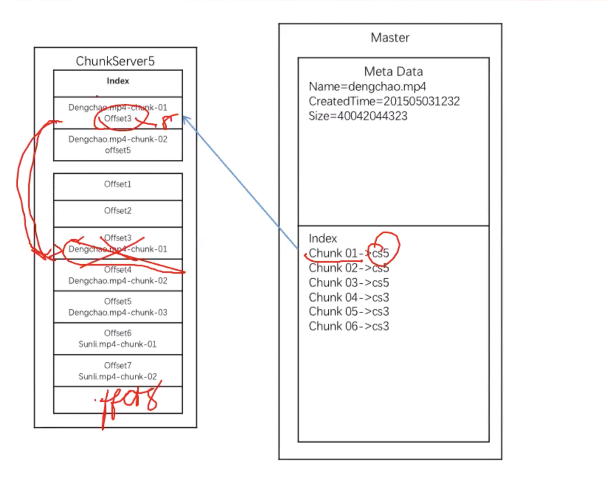
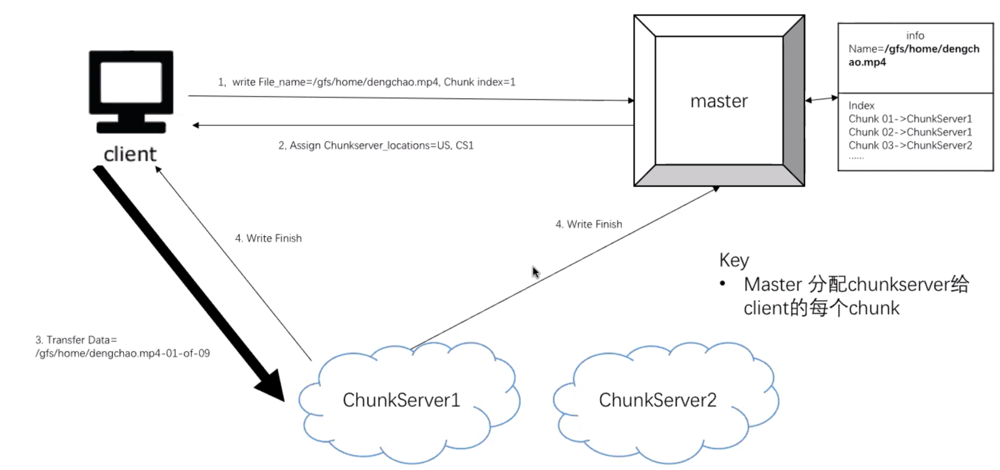
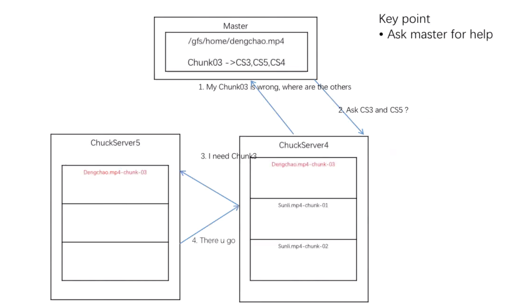
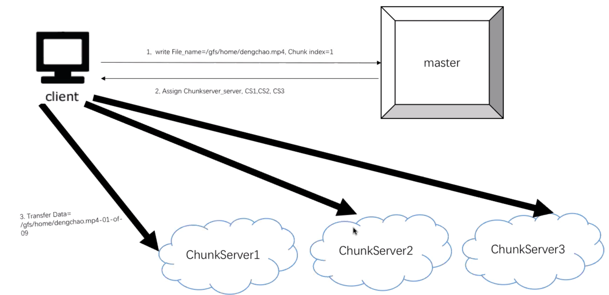
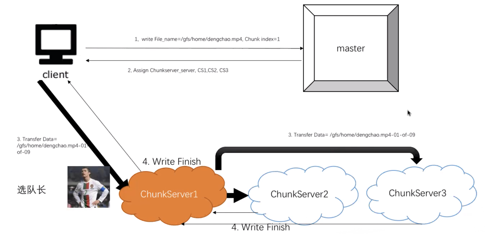
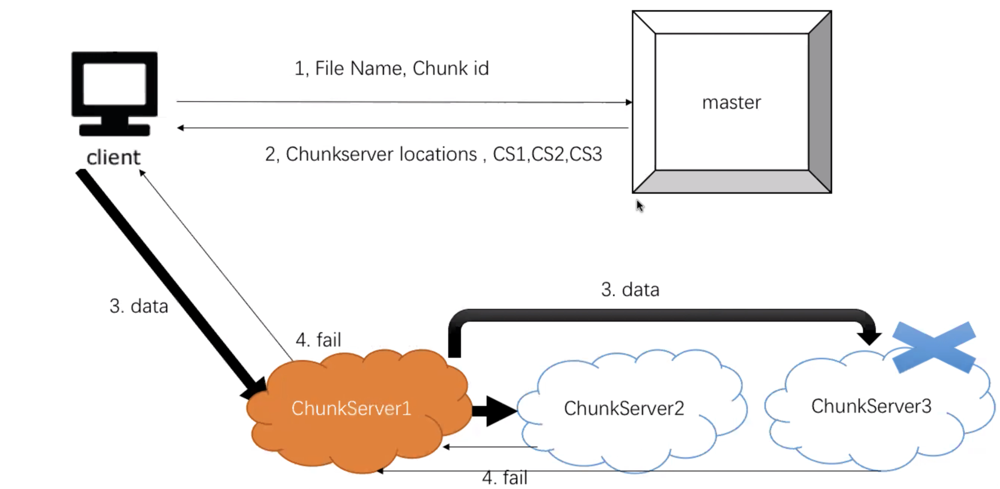
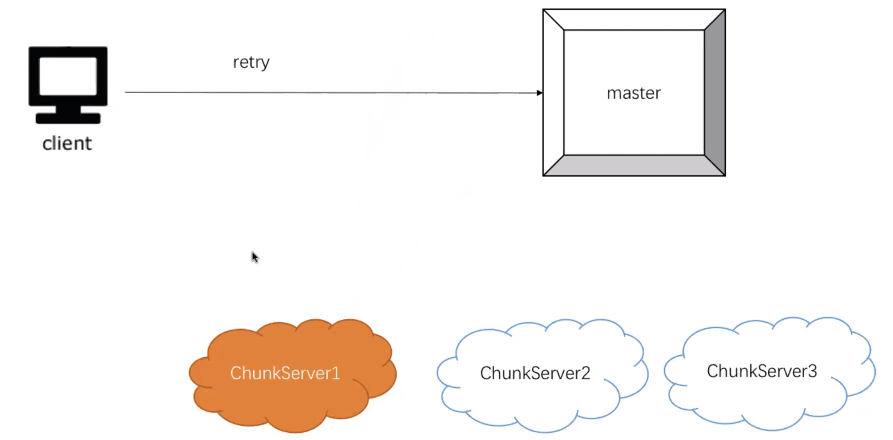
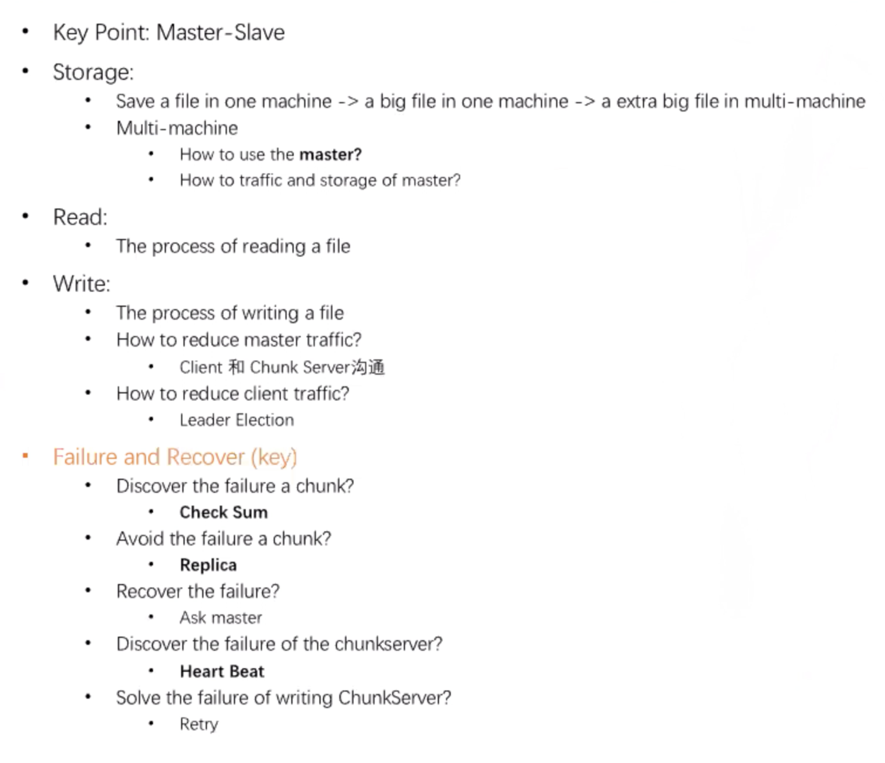

# Distributed Systems

## Distributed File System

### Scenarios

* Requirement 1
  * Write to a file, read from a file
  * how large of a file should it support?
    * As large as possible? like &gt; 1000T
* Requirement 2
  * Use multiple machines to store these files
  * Support how many machines?
    * As many as possible? 100000 machines for google on 2007

### Service

#### Architecture

* Client - Server \(Many Servers\)
  * Peer to Peer \(点对点\) 
  * Master + Slave

#### Master + Slaves

* Advantages
  * Simple design
  * it's easy to keep data consistency
* Disadvantages
  * Single master is down -&gt; whole system is down

#### Final Decision

* Master + slave
* Just restart master when it is down

### Storage

#### Where to store big files

* File systems

#### How files being stored in disk

* Meta data and file stored separately
* Usually stored as block, and the size of the block is usually 1024 bytes

#### Interviewer: how to save a large file in one machine

* Is block size big enough?
* 100T = 100 \* 1000G = 100 \* 1000 \* 1000M = 100 \* 1000 \* 1000 \* 1000K = 
  * 100 \* 1000 \* 1000 \* 1000 \* 1000 block


Usually a big file is merged from many files


* There's another unit called chunk
  * 1 chunk = 64M = 64 \* 1024k
  * Advantages
    * Reduced the size of meta data
  * Disadvantages
    * Waste space for small files

#### Scale about the storage


Usually, the offset will be stored on chuck server


#### What is the estimated size of the meta data for large files

* For example, like 10P
  * usually, 64MB chunk needs 64 bytes
  * 16 \* 10 ^ 6 chunks need 10G meta data -&gt; can be stored on one machine 

#### How to write a file

* Since the chunk is used to store large files, it is also used as the unit for transmitting and writing
* Client needs to break the file down, master handles the entire system, and cannot handle this breakdown for files.

#### How to modify the file

* Delete the original file and rewrite the entire file


For most of the distributed file system, it is one time to write, many time to read



Usually, things like log, raw or intermediate data for map-reduce will be stored to DFS


#### How to read a file

* Send request to master, master will tell client where are all those chunks located \(through index list\)

#### Master

* Store metadata
* Store map \(file name + chunk index -&gt; chunk server\)
  * find chunk server when read
  * find idle server when write

### Scale

#### Scale on failure and recover

How to identify if a chunk on the disk is broken

* Checksum
  * check one bit error
  * size -&gt; 4 bytes 32 bits
  * each chunk has a checksum
  * when to write checksum
    * every time when it finishes writing a chunk
  * when to read and check checksum
    * when trying to read a chunk
    * calculate current checksum
    * comparing if current checksum is equal to previous checksum

How to avoid chunk data loss when a chuck server is down or failing

* Replica

What are the strategies to pick a chunk server

* Least Recently Used \(LRU\)
* Low disk usages
* backup vs replica
  * backup offline, replica online

How to recover when a chunk is broken

* Ask master for help

How to find a chunk server is down

* Heart beat every three seconds, slave -&gt; master

#### Scale on write

A ok way:

Disadvantage of above structure:

* Client gets heavy workloads

How to find that representative server

* the closet/fastest one
* idle server \(balance traffic\)
* is not fixed

How to solve chunk server failure

* Server who fails to write will speak loudly to notify representative server
* And once client gets notification on failure, it will retry the same request to master
* master will replace the failed one with a replica chunk server, and points to this new server

### Summary

## Design Bigtable

What is a Bigtable

* Throughput of NoSQL &gt;&gt;&gt; Relational SQL

