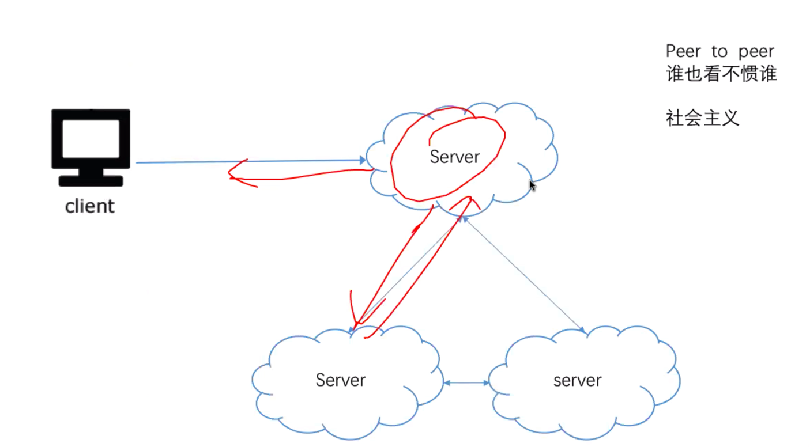
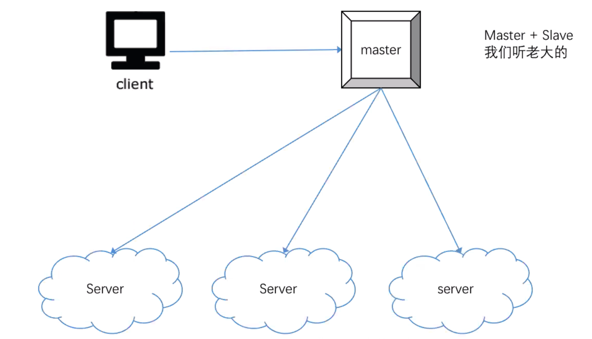
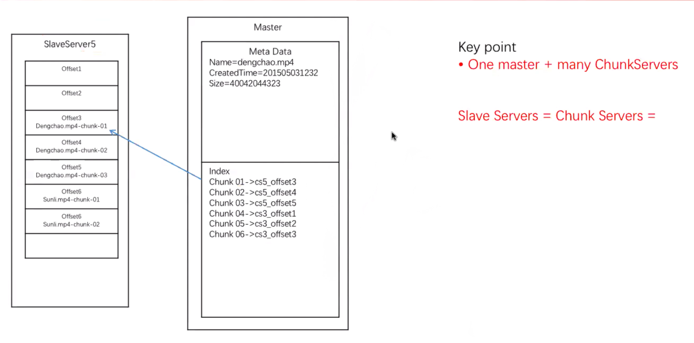

# Distributed Systems

## Distributed File System

### Scenarios

* Requirement 1
  * Write to a file, read from a file
  * how large of a file should it support?
    * As large as possible? like &gt; 1000T
* Requirement 2
  * Use multiple machines to store these files
  * Support how many machines?
    * As many as possible? 100000 machines for google on 2007

### Service

#### Architecture

* Client - Server \(Many Servers\)
  * Peer to Peer \(点对点\) 
  * Master + Slave

#### Master + Slaves

* Advantages
  * Simple design
  * it's easy to keep data consistency
* Disadvantages
  * Single master is down -&gt; whole system is down

#### Final Decision

* Master + slave
* Just restart master when it is down

### Storage

#### Where to store big files

* File systems

#### How files being stored in disk

* Meta data and file stored separately
* Usually stored as block, and the size of the block is usually 1024 bytes

#### Interviewer: how to save a large file in one machine

* Is block size big enough?
* 100T = 100 \* 1000G = 100 \* 1000 \* 1000M = 100 \* 1000 \* 1000 \* 1000K = 
  * 100 \* 1000 \* 1000 \* 1000 \* 1000 block


Usually a big file is merged from many files


* There's another unit called chunk
  * 1 chunk = 64M = 64 \* 1024k
  * Advantages
    * Reduced the size of meta data
  * Disadvantages
    * Waste space for small files

### Scale

#### Scale about the storage

